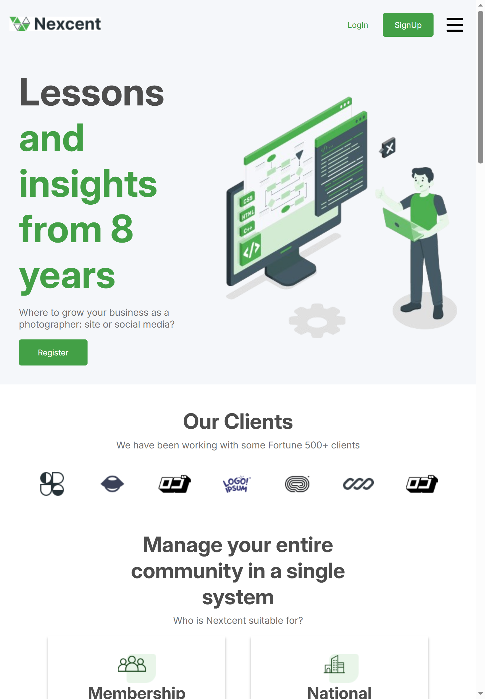
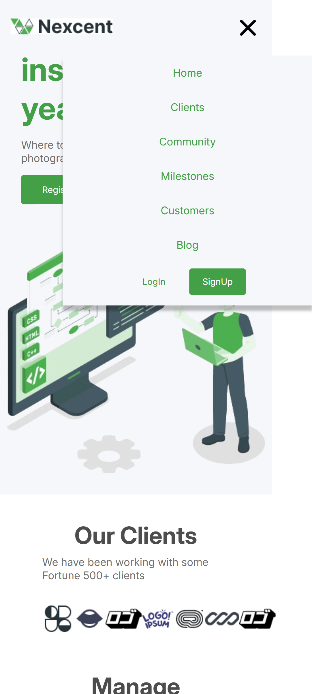

# :office: Nexcent Design Agency Landing Page
 
 
 

This project is a pixel-perfect front-end implementation of a design agency website, based entirely on a Figma design file. The goal of the project is to demonstrate precision in translating UI designs into clean, responsive, and accessible HTML/CSS code.


## Purpose
This project was built purely for practice and portfolio purposes, to showcase front-end skills and attention to design detail.


## Tech Stack   


- HTML5
- CSS3 
- Figma for UI Reference
  

## Features

- Pixel-perfect layout matching the Figma design
- Fully responsive (desktop, tablet, mobile)
- Cross-browser compatibility
- Semantic and accessible HTML structure
- Organized, maintainable CSS


## Live Demo (cahange)

🔗 [View Live Site](www.google.com)
(Change)


## Preview 

<p align="center">
  
  
  
</p>


## Project Structure

``` 
/ 
├── assets/ 
│   └── desktop.png 
│   └── mobile.png 
│   └── tablet.png 
├── clients/ 
│   └── Logo (1).jpg 
│   └── Logo (2).jpg 
│   └── Logo (3).jpg 
│   └── Logo (4).jpg 
│   └── Logo (5).jpg 
│   └── Logo (6).jpg 
│   └── Logo (7).jpg 
├── community updates/ 
│   └── image 18.png 
│   └── image 19.png 
│   └── image 20.png 
├── count/ 
│   └── icon 1.jpg 
│   └── icon 2.jpg 
│   └── icon 3.jpg 
├── customer/ 
│   └── customer.jpg 
├── icons/ 
│   └── bars-solid-full.svg 
│   └── xmark-solid-full.svg 
├── Images/ 
│   └── Frame 35.jpg 
│   └── Illustration.png 
│   └── Logo.jpg 
│   └── pana.jpg 
├── members/ 
│   └── Icon-1.jpg 
│   └── Icon-2.jpg 
│   └── Icon-3.jpg 
├── index.html 
├── main.js 
├── style.scss
└── README.md 
``` 
 


## Usage (change)
1. Clone the repository (change)

```bash
git clone https://github.com/sam8284/recipe-finder.git
cd recipe-finder
```

2. Navigate to the project directory(change)

```bash
cd recipe-finder
```
3. Run the App:
- Open the index.html file in your browser or use a live server (like VS Code Live Server extension) for better development experience.

```bash
open index.html
```

✅ No build tools or dependencies needed.


## Contact

[](mailto:saima.ansari8811@gmail.com)

[](https://www.linkedin.com/in/saima-ansari-developer/)


## License

This project is licensed under the MIT License. See the [MIT LICENSE](./LICENSE) file for more information.


## Acknowlegement
- [Figma Reference File](https://www.figma.com/design/MrgeaGLlU3AxATuEG3OlER/Minimal-Landing-Page-Design-%7C-Website-Home-Page-Design-%7C-Agency-Website-UI-Design--Community-?node-id=0-1&t=B9B4ENl33Eqb6foS-1)
- [Font Awesome](https://fontawesome.com/icons) for icons
- [Google Fonts](https://fonts.google.com/) for icons
